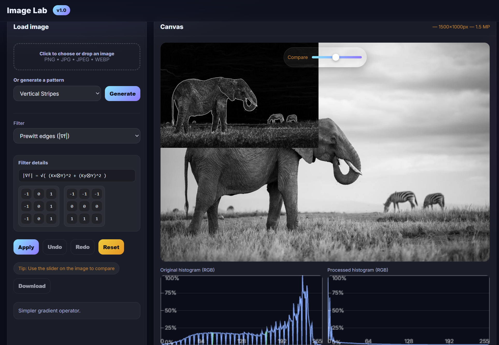

# Image Lab

An interactive web application for experimenting with **image processing concepts** such as filters, noise addition, histogram operations, and 2D Fourier Transforms.  
Built with plain HTML, CSS, and JavaScript — no external frameworks required.

---

## 🚀 Live Demo

👉 [Try Image Lab here](https://shahryarfp.github.io/Image-Lab/)

---

## 📸 Preview

  

---

## ✨ Features

- Load your own images or generate synthetic patterns (stripes, circles, squares, etc.)
- Apply **point operators** (negative, gamma, brightness/contrast, thresholding, etc.)
- Add different types of **noise** (Gaussian, uniform, salt & pepper, speckle)
- Explore **local filters** (mean, Gaussian blur, median, sharpen, custom 3×3 kernel)
- Detect edges with **Sobel, Prewitt, Laplacian**
- Perform **histogram equalization** and stretching
- Visualize **histograms, LUTs, transfer curves**
- Compute **2D Fourier Transform** (amplitude and phase, linear/log view)
- Undo/redo and download results

---
